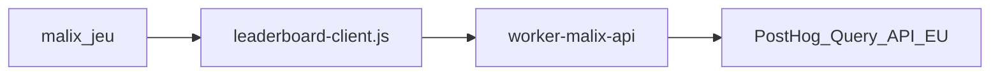

# Malix — Hall of Fame in-game (classement)

**Statut : slices 1–3 (code) livrées (2026-05-16) ; deploy prod `malix-api` à lancer une fois (`wrangler deploy`) ; slices 4–6 planifiées.** Ce document est la **source de vérité** pour générer un plan d’implémentation par session (une slice = une session).

**Suivi d’avancement :** [docs/PLAN.md](../PLAN.md) (tableau slices, statut Planned/Done).

**Références normatives :** [docs/SPEC-Malix.md](../SPEC-Malix.md) § 5.7 et § 6.4 ; [docs/ARCH.md](../ARCH.md) (composant `worker-malix-api`) ; dashboard staff [docs/posthog-malix-hall-of-fame.md](../posthog-malix-hall-of-fame.md) ; analytics [docs/analytics-posthog.md](../analytics-posthog.md).

**Prérequis déjà livrés (hors slices HoF) :** `malix-player-id`, `posthog.identify`, `malix_player_snapshot`, propriétés personne PostHog, dashboard PostHog projet [124663](https://eu.posthog.com/project/124663/dashboard/684717).

---

## Validation slice 1 (2026-05-16)

### Contrat API

- **Validé** : JSON 200 (`updated_at`, `total_players`, `player`, `top` max 10) ; erreurs `400` (`missing_player_id`, `invalid_player_id`), `429` (`rate_limited`, livraison slice 3), `502` (`leaderboard_unavailable`).
- **Hors contrat** (implémentation slice 2+) : `404` / `405` — comportement technique Worker, non documenté pour le client Malix.
- **Règles figées** : fenêtre **90 jours** ; tri `malidex_unique` DESC puis `captures` DESC ; HogQL `LIMIT 500` ; UI **top 10** ; `display_code` aligné [`malix/assets/player-id.js`](../../malix/assets/player-id.js).

### Validation HogQL

- **Date** : 2026-05-16 (PostHog MCP `query-run`, projet EU **124663**).
- **Runs** : 3 exécutions (t0, +30 s, +60 s) — résultats stables.
- **Latence** : ~1–2 s par run (round-trip MCP ; volume actuel faible) — **sous l’objectif 5 s** hors cache.
- **Lignes retournées** : 3 joueurs (≤ 500).
- **Colonnes** : `player_id`, `malidex`, `captures`, `photos`, `trades`.
- **Parité dashboard** : **OK** — top 3 identique à l’insight [Classement Malidex (top 50)](https://eu.posthog.com/project/124663/insights/omUc9UwC) (même HogQL ; dashboard `LIMIT 50`, API Worker `LIMIT 500` pour le calcul du rang).

---

## Objectif produit

Afficher dans le jeu, sous le Malidex, un **classement agrégé** (Hall of Fame) issu de PostHog, avec **mise en avant de la position du joueur local** (`malix_player_id`). Lecture seule, sans compte, sans compétition PvP pendant le jeu.

**Choix UI validé :** 3e onglet Malidex **« Classement »** (à côté de « Malix » et « Album »).

---

## Architecture cible



| Composant | Rôle |
|-----------|------|
| Ingestion | Inchangée — `https://e.festibask-impro.fr` via [`worker-posthog/`](../../worker-posthog/) |
| BFF | **`worker-malix-api/`** — HogQL + JSON ; secret `POSTHOG_PERSONAL_API_KEY` |
| Client Malix | **`malix/assets/leaderboard-client.js`** — `fetch` vers le BFF, cache session 60 s |
| UI | Onglet Malidex, panneau `#malidexPanelLeaderboard` |

**Contrainte routing :** `e.festibask-impro.fr` = proxy ingest **uniquement**. Ne pas y ajouter `/malix/api/*`.

**URL prod recommandée :** `GET https://festibask-impro.fr/malix/api/leaderboard?player_id=<uuid>`

**Alternative slice 3 :** sous-domaine `api.festibask-impro.fr` si conflit route Workers ↔ GitHub Pages — **trancher et documenter en fin de slice 3**.

---

## Contrat API (normatif — slice 1)

### Requête

| Élément | Valeur |
|---------|--------|
| Méthode | `GET` |
| Chemin | `/malix/api/leaderboard` |
| Query | `player_id` (UUID v4, obligatoire) = `malix-player-id` local |

### Réponses d’erreur

| Code | Corps JSON | Cas |
|------|------------|-----|
| `400` | `{ "error": "missing_player_id" }` ou `{ "error": "invalid_player_id" }` | Param absent ou UUID invalide |
| `429` | `{ "error": "rate_limited" }` | Trop de requêtes (slice 3) |
| `502` | `{ "error": "leaderboard_unavailable" }` | PostHog indisponible, clé absente, requête HogQL en échec |

### Réponse `200` (JSON)

| Champ | Type | Description |
|-------|------|-------------|
| `updated_at` | string ISO 8601 | Horodatage de génération |
| `total_players` | number | Joueurs distincts dans la fenêtre |
| `player.player_id` | string | UUID demandé (réponse ; pas affiché pour les autres en UI) |
| `player.display_code` | string | 8 caractères hex majuscules |
| `player.rank` | number | 1 = meilleur ; si absent des données : `total_players + 1` et stats à 0 |
| `player.malidex_unique` | number | |
| `player.captures` | number | |
| `player.photos` | number | |
| `player.trades` | number | |
| `top` | array | Max **10** lignes pour l’UI |
| `top[].rank` | number | |
| `top[].display_code` | string | Jamais d’UUID tiers en UI |
| `top[].malidex_unique` | number | |
| `top[].captures` | number | |
| `top[].photos` | number | |
| `top[].trades` | number | |

Exemple :

```json
{
  "updated_at": "2026-05-16T12:00:00Z",
  "total_players": 142,
  "player": {
    "player_id": "a3f91b2c-4d5e-4789-abcd-ef0123456789",
    "display_code": "A3F91B2C",
    "rank": 12,
    "malidex_unique": 34,
    "captures": 41,
    "photos": 2,
    "trades": 1
  },
  "top": [
    {
      "rank": 1,
      "display_code": "F4E2B891",
      "malidex_unique": 108,
      "captures": 120,
      "photos": 5,
      "trades": 3
    }
  ]
}
```

### Règles de classement (figées slice 1)

1. Tri : `malidex_unique` DESC, puis `captures` DESC.
2. Fenêtre : **90 jours** glissants (`timestamp >= now() - INTERVAL 90 DAY`).
3. Requête HogQL interne : agrégation par `properties.malix_player_id`, `LIMIT 500` pour calcul du rang ; UI n’affiche que le top 10.
4. `display_code` : `uuid.replace(/-/g,'').slice(0,8).toUpperCase()` — aligné [`malix/assets/player-id.js`](../../malix/assets/player-id.js) `formatDisplayCode`.

### HogQL de référence

```sql
SELECT
  properties.malix_player_id AS player_id,
  max(person.properties.malidex_unique) AS malidex,
  countIf(event = 'malix_capture') AS captures,
  countIf(event = 'malix_photo_saved') AS photos,
  countIf(event = 'malix_trade_completed') AS trades
FROM events
WHERE properties.malix_player_id IS NOT NULL
  AND event IN (
    'malix_capture',
    'malix_photo_saved',
    'malix_trade_completed',
    'malix_player_snapshot',
    'malix_game_start'
  )
  AND timestamp >= now() - INTERVAL 90 DAY
GROUP BY player_id
ORDER BY malidex DESC, captures DESC
LIMIT 500
```

**Validation slice 1 :** exécuter cette requête dans PostHog (UI ou MCP) ; noter la **latence typique** (objectif &lt; 5 s hors cache ; cache BFF 3 min en prod).

---

## Comportement UI (normatif — slice 5)

- Onglet **« Classement »** dans `.malidex-tabs` ; panneau `#malidexPanelLeaderboard`.
- À l’activation de l’onglet : chargement (« Chargement du classement… »), puis rendu ou erreur.
- **Top 10** : liste ordonnée ; colonnes visibles minimales : rang, code, Malidex (ex. `34/108`), captures.
- **Encart « Ta place »** : « Tu es {rank}e sur {total_players} chasseurs » + stats ; si `rank <= 10` et présent dans `top`, classe `is-you` sur la ligne.
- **Erreur** : « Classement indisponible. Reessaie dans un instant. » (sans crash).
- **Cache client** : `sessionStorage`, clé `malix-leaderboard-cache-v1`, TTL **60 s**, invalidé si `player_id` change.
- **Pas de refresh** à chaque capture (v1) : uniquement à l’ouverture de l’onglet (sauf cache session valide).
- **Accessibilité** : `role="tab"`, `aria-selected`, zone `aria-live="polite"` pour statut.

### Analytics (à trancher en slice 5)

- Événement proposé : **`malix_leaderboard_open`** (sans propriétés sur les autres joueurs).
- Mettre à jour [docs/analytics-posthog.md](../analytics-posthog.md) et SPEC-Malix § 1.4 lors de l’implémentation.

---

## Slice 1 — Cadrage et validation (session doc) — Done

**Objectif :** figer le contrat ; aucun code Worker ni UI.

**Entrées :** ce document, [docs/SPEC-Malix.md](../SPEC-Malix.md), [docs/ARCH.md](../ARCH.md).

**Tâches :**

1. [x] Valider le JSON et les codes d’erreur ci-dessus (ajuster si besoin).
2. [x] Exécuter la HogQL dans PostHog ; documenter latence observée (section [Validation slice 1](#validation-slice-1-2026-05-16)).
3. [x] Confirmer fenêtre 90 j et top 10 (déjà figés ici).
4. [x] Vérifier cohérence SPEC § 5.7 / § 6.4 et ARCH « Malix — API classement ».

**Livrables :**

- [x] Ce fichier à jour (statut slice 1 cochée dans PLAN).
- [x] Aucun nouveau fichier code.

**Critère de fin :** contrat API + HogQL validés ; SPEC/ARCH alignés ; prêt pour slice 2.

**Hors scope :** `worker-malix-api/`, `leaderboard-client.js`, modifications `malix/index.html`.

---

## Slice 2 — Worker BFF local (session code) — Done

**Objectif :** Worker qui interroge PostHog et renvoie le JSON du contrat.

**Dépend de :** slice 1 terminée.

**Fichiers créés :**

| Fichier | Rôle |
|---------|------|
| `worker-malix-api/wrangler.jsonc` | `name: "malix-api"`, `main: "src/index.js"` |
| `worker-malix-api/src/index.js` | Route `GET /malix/api/leaderboard` ; OPTIONS pour CORS futur |
| `worker-malix-api/src/posthog-query.js` | `POST https://eu.posthog.com/api/projects/124663/query/` |
| `worker-malix-api/src/leaderboard.js` | Parse `results` HogQL → `buildLeaderboardFromRows(rows, playerId)` |
| `worker-malix-api/src/player-id.js` | `isValidPlayerId`, `formatDisplayCode` (aligné Malix) |
| `worker-malix-api/README.md` | Secrets, `wrangler dev`, curl de test |
| `tests/malix/leaderboard-build.test.js` | Tests sur `buildLeaderboardFromRows` (fixtures, sans API live) |

**Comportement minimal :**

- [x] `player_id` obligatoire ; UUID invalide → 400.
- [x] Pas de `POSTHOG_PERSONAL_API_KEY` en dev → 502 `leaderboard_unavailable`.
- [x] Pas de cache Worker ni CORS prod (slice 3).

**Validation locale (2026-05-16) :** `npx wrangler dev` — `400` (`missing_player_id`, `invalid_player_id`), `502` sans secret, `404` hors route ; `npm run test:malix` vert (24 tests). Réponse `200` avec clé PostHog : après `wrangler secret put POSTHOG_PERSONAL_API_KEY`.

**Secrets :**

```bash
cd worker-malix-api
npx wrangler secret put POSTHOG_PERSONAL_API_KEY
```

**Test manuel :**

```bash
npx wrangler dev
curl "http://127.0.0.1:8787/malix/api/leaderboard?player_id=<uuid-de-test>"
```

**Critère de fin :** réponse JSON conforme au contrat ; tests Node passent.

---

## Slice 3 — Production : deploy, CORS, cache, sécurité — Done (code)

**Objectif :** endpoint joignable depuis `https://festibask-impro.fr/malix/` sans exposer la clé PostHog.

**Dépend de :** slice 2.

**Tâches :**

1. [x] Code prêt pour `npx wrangler deploy` (compte Cloudflare = même que `worker-posthog/`).
2. [x] **Worker Route** dans `wrangler.jsonc` : `festibask-impro.fr/malix/api/*` → script `malix-api`.
3. [x] **CORS** dans `worker-malix-api/src/index.js` : `https://festibask-impro.fr` ; dev `localhost` / `127.0.0.1` (http + https).
4. [x] **Cache** : `Cache-Control: public, max-age=180` + `caches.default` ; clé = URL complète incluant `player_id`.
5. [x] **Rate limit** : ~30 req / min / IP (`429 rate_limited`).
6. [x] [docs/DEVELOPMENT.md](../DEVELOPMENT.md) : section Worker + proxy Vite `/malix/api` → `127.0.0.1:8787`.
7. [x] [docs/posthog-malix-hall-of-fame.md](../posthog-malix-hall-of-fame.md) : URL API prod documentée.

**Deploy prod (action manuelle, une fois par environnement) :**

```bash
cd worker-malix-api
npx wrangler login
npx wrangler secret put POSTHOG_PERSONAL_API_KEY
npx wrangler deploy
```

**État au 2026-05-16 :** le script `malix-api` n’était pas encore sur Cloudflare (seul `posthog-proxy` listé) ; `https://festibask-impro.fr/malix/api/leaderboard` renvoyait **404 GitHub Pages** tant que le deploy n’est pas fait. Après deploy, la route Worker doit prendre le pas sur ce préfixe uniquement. Si conflit persistant : sous-domaine `api.festibask-impro.fr` (alternative ci-dessus).

**Validation locale (code) :** `wrangler dev` — `400`, `502` sans secret, `OPTIONS` 204 ; `npm run test:malix` vert.

**Test prod (après deploy) :**

```javascript
// Console sur https://festibask-impro.fr/malix/
fetch('/malix/api/leaderboard?player_id=' + localStorage.getItem('malix-player-id')).then(r => r.json()).then(console.log)
```

Vérifier onglet Network : **aucune** clé PostHog dans les requêtes.

**Critère de fin :** code CORS/cache/rate limit livré ; `fetch` prod OK après `wrangler deploy` + secret.

---

## Slice 4 — Client Malix (session code)

**Objectif :** module données isolé ; pas d’UI classement.

**Dépend de :** slice 3 (URL prod ou proxy dev documenté).

**Fichiers :**

| Fichier | Rôle |
|---------|------|
| `malix/assets/leaderboard-client.js` | `fetchLeaderboard(playerId)`, cache session, timeout 8 s |
| `malix/index.html` | `<script src="./assets/leaderboard-client.js">` avant `app.js` |
| `tests/malix/leaderboard-client.test.js` | `buildUrl`, cache round-trip (mock `sessionStorage`) |

**API exposée (global) :** `window.MalixLeaderboard.fetchLeaderboard(playerId, { forceRefresh })`

**Constantes :** `LEADERBOARD_PATH = '/malix/api/leaderboard'`

**Critère de fin :** en prod, `MalixLeaderboard.fetchLeaderboard(localStorage.getItem('malix-player-id'))` résout avec le payload attendu.

---

## Slice 5 — UI onglet « Classement » (session code)

**Objectif :** écran enfant-friendly + mise en avant du joueur.

**Dépend de :** slice 4.

**Fichiers à modifier :**

| Fichier | Modifications |
|---------|----------------|
| `malix/index.html` | Bouton onglet `#malidexTabLeaderboardBtn` ; panneau `#malidexPanelLeaderboard` (`#leaderboardStatus`, `#leaderboardYou`, `#leaderboardList`) |
| `malix/assets/style.css` | `.leaderboard-*` ; onglet 3 colonnes si besoin |
| `malix/assets/app.js` | `setMalidexTab('malix' \| 'album' \| 'leaderboard')` ; `loadLeaderboard()` ; `renderLeaderboard()` ; dépendance `MalixLeaderboard` + `MalixPlayerId` |

**Logique `app.js` (indicative) :**

- `malidexActiveTab` : trois valeurs.
- Clic onglet Classement → `setMalidexTab('leaderboard')` → si besoin `loadLeaderboard()`.
- `loadLeaderboard` : appelle `MalixLeaderboard.fetchLeaderboard(playerId)` ; gère loading / error / data.
- `phCapture('malix_leaderboard_open')` si événement retenu.
- Incrémenter `?v=` sur `app.js` et `style.css` dans `malix/index.html`.

**Critère de fin :** parcours Malidex → Classement → top + « Ta place » ; mode avion → message d’erreur sans crash.

---

## Slice 6 — Finition et runbook (session doc + petits ajustements)

**Objectif :** robustesse festival et doc opérationnelle à jour.

**Dépend de :** slice 5.

**Tâches :**

1. Affiner timeout / cache si latence HogQL &gt; 5 s en pic.
2. Afficher « Classement mis à jour il y a X min » à partir de `updated_at` (optionnel mais recommandé).
3. [docs/posthog-malix-hall-of-fame.md](../posthog-malix-hall-of-fame.md) : URL API prod, parité HogQL Worker ↔ dashboard.
4. [docs/PLAN.md](../PLAN.md) : passer les 6 slices en Done.
5. [docs/ISSUES.md](../ISSUES.md) : limites connues si besoin (délai sync, pas de `malix_player_id` historique).
6. Checklist festival ci-dessous.

**Checklist test festival :**

- [ ] Deux téléphones, deux `malix-player-id` différents → rangs distincts dans l’onglet Classement.
- [ ] Joueur dans le top 10 → ligne surlignée.
- [ ] Joueur hors top 10 → encart « Tu es Ne… » correct.
- [ ] « Recommencer » la collection locale ne casse pas l’identité joueur ; rang global captures déjà envoyées inchangé côté PostHog.
- [ ] `npm run test:malix` vert.

**Critère de fin :** checklist validée ; doc à jour ; statut feature « livré » dans SPEC (retirer mention « planifié » § 3.1 / 5.7).

---

## Ordre des sessions (récapitulatif)

| # | Slice | Durée indicative | Type |
|---|--------|------------------|------|
| 1 | Contrat + HogQL validée | ~1 h | Doc |
| 2 | Worker local | ~2–3 h | Code + tests |
| 3 | Deploy + CORS + cache | ~1–2 h | Ops + code Worker |
| 4 | `leaderboard-client.js` | ~1 h | Code + tests |
| 5 | UI Malidex | ~2–3 h | Code |
| 6 | Finition | ~1 h | Doc + QA |

**Ne pas inverser :** 1 → 2 → 3 → 4 → 5 → 6.

---

## Hors scope (toutes slices)

- Hall of Fame sur le site principal (`index.html`).
- Modifier `worker-posthog` pour l’API classement.
- Noms réels, avatars, comptes enfants.
- Sync temps réel à chaque capture.
- Déploiement Worker via GitHub Actions (sauf décision documentée).

---

## Limites connues

- Un appareil ≈ un joueur PostHog ; pas de fusion multi-téléphones.
- Effacement des données navigateur → nouvel UUID.
- Délai sync (`malix_player_snapshot` + cache BFF).
- Événements avant déploiement `malix_player_id` absents du classement.

---

## Secrets (hors dépôt)

- `POSTHOG_PERSONAL_API_KEY` — projet PostHog **124663** (lecture seule recommandé).
- Compte Cloudflare — Worker Route sur `festibask-impro.fr` (même compte que le proxy PostHog).
